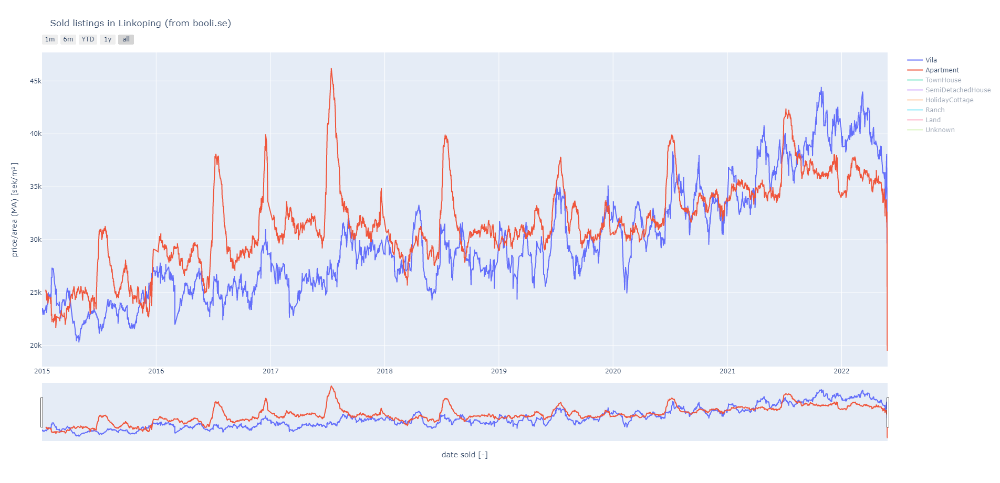

# Booli crawler

A crawler of [booli.se](https://booli.se) - a Swedish housing platform.

## Prerequisites
* python >=3.8 (tested)

## Installing
The crawler is written in Python and can be installed as a package, using ``pip``.
Assuming your standing in the project root:

```bash
pip install .
```

## Examples
Some examples and usage of the crawler can be found in ``booli_crawler.examples``. The
examples might use some additional dependencies which can be installed by:

```bash
pip install .[examples]
```



## Testing
The unit tests are written in ``pytest``. To install dependencies and run tests:

```bash
pip install .[test]
pytest .
```

They can also be run in a Docker container using make:

```bash
make
```
